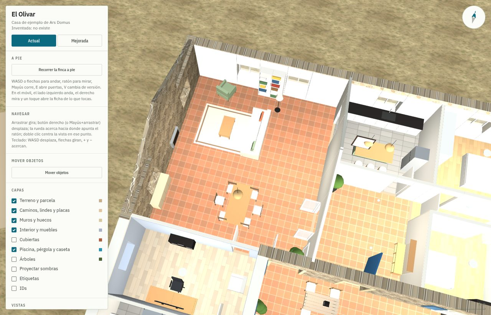
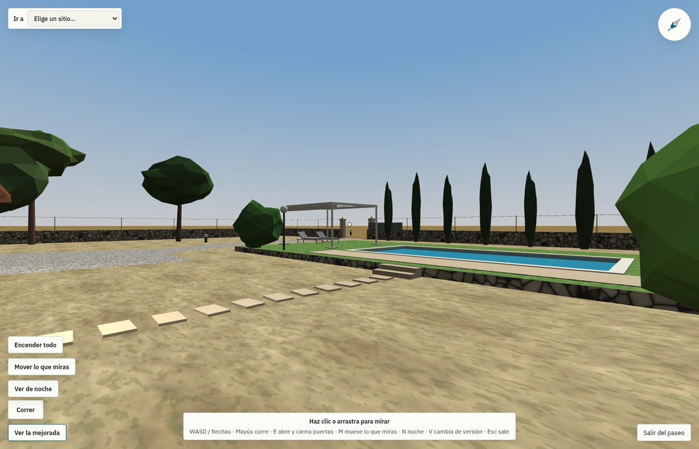
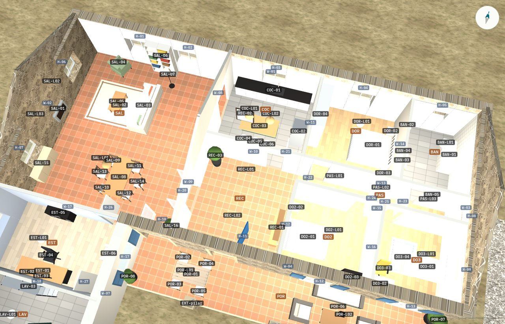
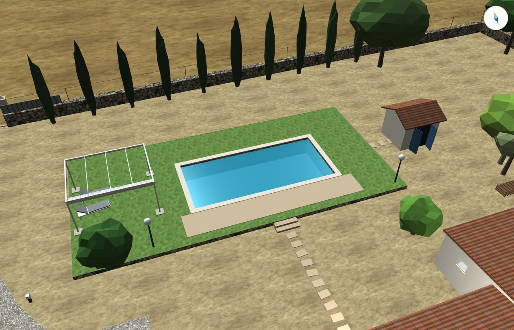
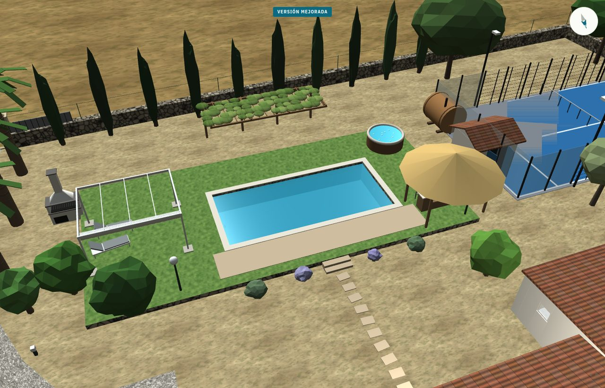
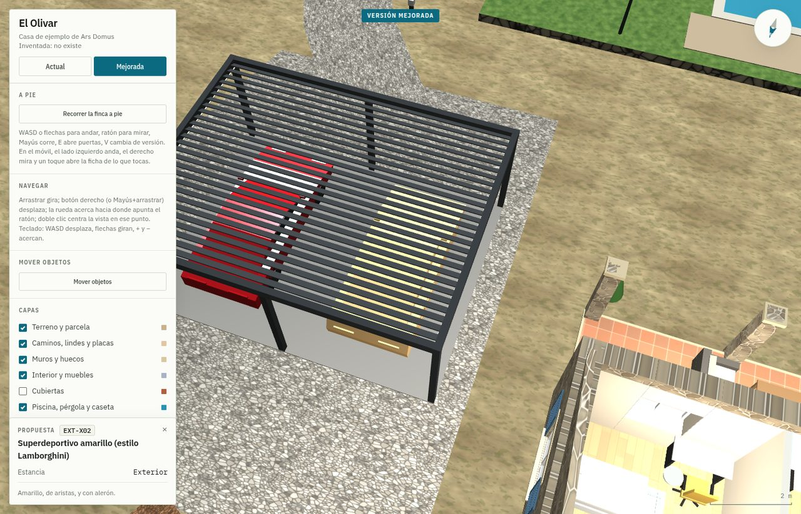

# Ars Domus

*El arte de la casa*, en homenaje al *Ars Magna* de Ramon Llull.

Tu casa en 3D con **Claude Code** y **three.js**: de un plano, unas fotos y
datos públicos del terreno a una maqueta que se pasea en el navegador, con
la casa actual y una propuesta de reforma para compararlas desde el mismo
sitio. Nada se modela a mano: las fuentes se convierten en datos, un script
los escribe en un fichero y el visor los dibuja.

*Your house in 3D with Claude Code and three.js: from a floor plan, some
photos and public land data to a walkable browser model, with the current
house and a renovation proposal you can compare from the same viewpoint. Ars Domus, "the art of the house", is a nod to Ramon Llull's
Ars Magna.*

**Demo:** [ars-domus.arsmagnalab.com](https://ars-domus.arsmagnalab.com), una casa inventada
(«El Olivar») con su versión actual y una mejorada en la que soñar es gratis.



## Qué sale

- **La casa tal cual.** Muros, puertas y ventanas del plano; suelos, paredes, techos y muebles principales de las fotos.
- **Paseo a pie.** WASD y ratón, como en un videojuego. Las puertas se abren con la E y las ventanas son de cristal.
- **Antes y después.** Una segunda versión reformada. Con la tecla V se cambia de una a otra sin mover la cámara.
- **Vistas por estancia.** Cada habitación desde arriba y sin tejado, el jardín y el sol según la fecha y la hora.
- **Un ID para cada cosa.** Cada mueble, puerta, muro o árbol lleva su código (`SAL-04`, `H-12`, `A-145`): los cambios se piden sin ambigüedad.
- **También en el móvil.** El pulgar izquierdo anda, el derecho mira, un botón corre y un toque dice qué es cada cosa.

| | |
|---|---|
|  |  |
| **Paseo a pie.** A la altura de los ojos, con WASD y ratón o con los pulgares. | **La capa de IDs.** Rotula lo que hay cerca: muebles (`SAL-06`), luces (`SAL-L02`), huecos (`H-12`). |
|  |  |
| **Actual.** La piscina, la pérgola y la caseta. | **Mejorada**, desde el mismo sitio: soñar es gratis. |

## Haz la tuya

Necesitas [Claude Code](https://claude.com/claude-code), este repo y:

- **El plano de la casa**, lo más nítido posible: imagen o PDF con cotas, o al menos una medida conocida
  (el largo de una pared) para sacar la escala. Es lo que más influye en que los muros salgan bien.
- **Fotos de todo**, cuantas más mejor: en cada habitación, desde las esquinas y dando la vuelta; fuera,
  rodeando la casa. No hace falta ordenarlas.
- **Los nombres que usáis** para cada sitio («el despacho», «la habitación de la abuela», «el porche de atrás»).
- **Opcional**: la referencia catastral o la ubicación, para la parcela, la ortofoto y los árboles.

Clona el repo, pon el plano en `casas/mi-casa/fuentes/` y las fotos en `casas/mi-casa/fotos/` (`casas/`
no se sube nunca a git), abre Claude Code en la carpeta del repo y pega esto, rellenando los corchetes.
El cómo trabajar ya lo sabe: está en [`CLAUDE.md`](CLAUDE.md).

```text
Quiero hacer la maqueta 3D de mi casa [y el terreno] con Ars Domus, en casas/mi-casa.

Lo que tengo:
- Plano en casas/mi-casa/fuentes: [imagen o PDF; con cotas, o una medida conocida para la escala]
- [Opcional] Referencia catastral [xxxx] o ubicación, para la parcela y la ortofoto
- Fotos del interior y del exterior en casas/mi-casa/fotos: [nº], sin ordenar
- Cómo llamamos a cada sitio: [salón, cocina, habitación de X, porche de atrás…]

Primero la casa tal cual, por fases: el esqueleto del plano, el exterior y el interior por tandas de
fotos. Cuando ya se parezca, una versión mejorada con cambios razonables, estéticos o de distribución,
avisando de lo que haya que comprobar. Enséñame cada fase con capturas; te iré corrigiendo cosas
concretas y pasando más fotos.
```

El trabajo es largo: la primera fase ya lleva un buen rato, y Claude Code sigue solo mientras tanto.
A nosotros nos llevó unas pocas tardes, con un par de centenares de fotos, tener la casa y el jardín en
sus dos versiones. Buena parte es Claude trabajando solo entre mensaje y mensaje.

### Cómo va el trabajo

1. **Plano y esqueleto.** Muros, huecos y tejados. Revisa sobre todo dónde van las ventanas: el plano no siempre acierta.
2. **Exterior.** Terreno, caminos, piscina y árboles. Pásale fotos dando la vuelta a la casa.
3. **Interior por tandas.** Unas 40 fotos cada vez. Tras cada tanda, recorre la casa a pie y apunta lo que no cuadra.
4. **Correcciones.** Listas cortas, habitación por habitación. Cada ronda deja la casa bastante más fiel.
5. **Versión mejorada.** Cuando la actual ya se parece, pide la primera propuesta y luego ve habitación por habitación.

### Cómo pedir correcciones

Di qué pasa, dónde y hacia qué lado, con los nombres de tu casa:

- ✅ La puerta de la cocina al salón abre hacia el otro lado y queda pegada a la pared.
- ✅ En el garaje, la lavadora va en el rincón y el lavabo junto a la puerta.
- ✅✅ `SAL-07` va medio metro más al norte, `H-12` es una ventana y no una puerta, y quita `A-087`.
- ❌ El garaje está raro.

Con los IDs no hay dudas: toca el objeto, copia su código de la ficha y pégalo en el mensaje. Si dices
«en la mejorada», cambia la propuesta; si no, corriges cómo es la casa de verdad. Y moverlo a mano es más
rápido que describirlo: en el modo «Mover objetos» se arrastra un mueble a su sitio, el visor lo guarda
en `cambios.json` y Claude lo pasa a los datos.



### Lo que aprendimos

- **Nombres primero.** Al principio confundió habitaciones porque el plano las llamaba de otra forma.
- **Las fotos mandan sobre el plano.** El nuestro tenía una puerta que era una ventana y una ventana desplazada.
- **Mejor pocos muebles bien puestos que muchos a ojo.** Si hay duda, que no lo ponga y pregunte.
- **Que mire sus capturas.** Así encuentra solo muchos fallos: muebles atravesando paredes, texturas negras…
- **Los IDs, pronto.** Nosotros los añadimos tarde; desde entonces cada corrección es una línea.
- **Para enseñarla en casa**, que Vite la sirva por la wifi (`--host` con la IP del ordenador). Para
  enseñarla fuera, `npm run build` deja una versión estática que se sube a cualquier sitio. Antes de
  publicarla, quita lo que diga dónde está: dirección, referencia catastral, coordenadas y nombres.

## Cómo funciona por dentro

Todo el proyecto es una cadena en una dirección: las fuentes se convierten en datos, los datos se
escriben en un único fichero y el visor lo dibuja. Nada se modela a mano en 3D. Si algo está mal, se
corrige el dato o el script que lo produce y se regenera todo, que tarda menos de un segundo.

```mermaid
flowchart LR
  subgraph Fuentes
    CAT[Catastro<br/>WFS INSPIRE, GML]
    ORTO[Ortofoto PNOA<br/>WMS del IGN]
    PLANO[Plano de la casa]
    FOTOS[Fotos]
  end
  subgraph Extracción
    PAR[Parcela y huella]
    ENC[Encaje, piscina<br/>y árboles]
    MUR[Muros y huecos]
    MIRA[Claude mira las fotos:<br/>inventario y medidas]
  end
  CAT --> PAR
  ORTO --> ENC
  PLANO --> MUR
  FOTOS --> MIRA
  PAR & ENC & MUR & MIRA --> GEN[casa.py<br/>cada dato con su foto]
  GEN --> MEJ[mejora.py<br/>aplica actual]
  GEN & MEJ --> JS[casa.js<br/>generado]
  JS --> VISOR[visor.js<br/>three.js, WebGL]
  VISOR -. correcciones, cambios.json, capturas .-> GEN
```

| Paso | Cómo se hace |
|---|---|
| **Coordenadas** | Dos marcos: el **mundo** (metros, x al este, z al sur, origen en el centro de la casa) y el **plano** (u, v alineados con los muros). Un giro y un desplazamiento pasan de uno a otro. |
| **Parcela** | Los servicios públicos del Catastro (OVC y WFS INSPIRE) dan con la referencia catastral la superficie, las construcciones, la ubicación y los polígonos de la parcela y del edificio en UTM. |
| **Ortofoto** | El PNOA del IGN por WMS, en la misma proyección: a 10 cm por píxel, pasar de píxel a metro es una regla de tres. Es la referencia de lo que está a ras de suelo. |
| **Muros** | Del plano con NumPy y Pillow, sin redes neuronales: los muros son los píxeles oscuros; sumados por columnas y filas, cada pico es un muro con su grosor, y cada corte, un hueco. |
| **Encaje** | Se prueban giros y desplazamientos del contorno del plano sobre los bordes de la ortofoto; gana el que más gradiente suma. La piscina sale de un análisis de componentes principales de los píxeles de agua. |
| **Fotos** | Sin fotogrametría: Claude ve cada foto y la mide como un aparejador, con objetos de tamaño conocido, el horizonte, triangulando entre dos fotos y anclando a las paredes del plano. El sol de la fecha y la hora del EXIF orienta cada foto. |
| **Texturas** | Recortes de las fotos sin la luz (se dividen por una versión muy desenfocada de sí mismos) y sin junta (mezclados con una copia desplazada media baldosa). Las de la demo son generadas. |
| **Generador** | `casa.py` es casi todo datos, con la foto de la que sale cada uno. Las correcciones van en capas encima de lo extraído. `mejora.py` es una función de la casa actual: lo que se corrige en la casa le llega solo. |
| **Visor** | three.js r128 y nada más: muros extruidos con sus huecos, tres tipos de cubierta, unos 140 tipos de mueble hechos con cajas, cilindros y esferas, árboles con `InstancedMesh`, el sol calculado con fórmulas astronómicas y el paseo con rayos en vez de un motor de física. |
| **Bucle** | Vite recarga el navegador al regenerar `casa.js`. Claude saca capturas con Chrome headless (`?vista=salon&limpio`) y las mira antes de dar algo por hecho. Cada ronda de correcciones es un commit. |

Todo el modelado 3D es propio: sin modelos descargados, ni Blender, ni glTF, ni motor de juego. La única
librería en el navegador es three.js (MIT); Vite y Node solo sirven para trabajar en local, y los scripts
de Python usan NumPy y Pillow.

## Arrancar

```bash
npm install
npm run dev       # http://127.0.0.1:5173 — la casa de ejemplo, se recarga sola
npm run build     # dist/: la versión estática, la que se publica en GitHub Pages
npm run preview   # dist/ servida en http://127.0.0.1:5183
```

Otra casa: `CASA=casas/mi-casa npm run dev`. La carpeta lleva su `casa.js` (los datos que dibuja el
visor) y sus `texturas/`. La de ejemplo se genera con `python3 demo/herramientas/casa.py` y es el mejor
sitio para ver cómo se describe una casa; la referencia completa está en [`doc/datos.md`](doc/datos.md).

| Fichero | Qué es |
|---|---|
| `visor.js` | El motor: la escena three.js, los controles, el paseo a pie y el panel |
| `index.html` | Marcado y estilos del visor |
| `demo/` | La casa de ejemplo: sus datos (`casa.js`), cómo se generan y sus texturas |
| `CLAUDE.md` | Cómo trabaja Claude en este repo: montar una casa, cambiar el motor, publicar |
| `doc/datos.md` | Todo lo que entiende el visor en `casa.js` |
| `herramientas/build.mjs` | La versión estática en `dist/` |

---

Un proyecto de [Ars Magna](https://www.youtube.com/@arsmagna_lab), por Edu Herraiz.
Licencia [MIT](LICENSE).
