# Ars Domus

*El arte de la casa*, en homenaje al *Ars Magna* de Ramon Llull.

Tu casa en 3D con **Claude Code** y **three.js**: de un plano, unas fotos y
datos públicos del terreno a una maqueta que se pasea en el navegador, con
la casa actual y una propuesta de reforma para compararlas desde el mismo
sitio. Nada se modela a mano: las fuentes se convierten en datos, un script
los escribe en un fichero y el visor los dibuja.

*Your house in 3D with Claude Code and three.js: from a floor plan, some
photos and public land data to a walkable browser model, with the current
house and a renovation proposal you can compare from the same viewpoint. Ars Domus, "the art of the house", is a nod to Ramon Llull's
Ars Magna.*

**Demo:** [ars-domus.arsmagnalab.com](https://ars-domus.arsmagnalab.com), una casa inventada
(«El Olivar») con su versión actual y una mejorada en la que soñar es gratis.


## Qué sale

- **La casa tal cual.** Muros, puertas y ventanas del plano; suelos, paredes, techos y muebles principales de las fotos.
- **Paseo a pie.** WASD y ratón, como en un videojuego. Las puertas se abren con la E y las ventanas son de cristal.
- **Antes y después.** Una segunda versión reformada. Con la tecla V se cambia de una a otra sin mover la cámara.
- **Vistas por estancia.** Cada habitación desde arriba y sin tejado, el jardín y el sol según la fecha y la hora.
- **Un ID para cada cosa.** Cada mueble, puerta, muro o árbol lleva su código (`SAL-04`, `H-12`, `A-145`): los cambios se piden sin ambigüedad.
- **También en el móvil.** El pulgar izquierdo anda, el derecho mira, un botón corre y un toque dice qué es cada cosa.

| | |
|---|---|
|  |  |
| **Paseo a pie.** A la altura de los ojos, con WASD y ratón o con los pulgares. | **La capa de IDs.** Rotula lo que hay cerca: muebles (`SAL-06`), luces (`SAL-L02`), huecos (`H-12`). |
|  |  |
| **Actual.** La piscina, la pérgola y la caseta. | **Mejorada**, desde el mismo sitio: soñar es gratis. |

## Haz la tuya

Necesitas [Claude Code](https://claude.com/claude-code), este repo y:

- **El plano de la casa**, lo más nítido posible: imagen o PDF con cotas, o al menos una medida conocida
  (el largo de una pared) para sacar la escala. Es lo que más influye en que los muros salgan bien.
- **Fotos de todo**, cuantas más mejor: en cada habitación, desde las esquinas y dando la vuelta; fuera,
  rodeando la casa. No hace falta ordenarlas.
- **Los nombres que usáis** para cada sitio («el despacho», «la habitación de la abuela», «el porche de atrás»).
- **Opcional**: la referencia catastral o la ubicación, para la parcela, la ortofoto y los árboles.

Clona el repo, pon el plano en `casas/mi-casa/fuentes/` y las fotos en `casas/mi-casa/fotos/` (`casas/`
no se sube nunca a git), abre Claude Code en la carpeta del repo y pega esto, rellenando los corchetes.
El cómo trabajar ya lo sabe: está en [`CLAUDE.md`](CLAUDE.md).

```text
Quiero hacer la maqueta 3D de mi casa [y el terreno] con Ars Domus, en casas/mi-casa.

Lo que tengo:
- Plano en casas/mi-casa/fuentes: [imagen o PDF; con cotas, o una medida conocida para la escala]
- [Opcional] Referencia catastral [xxxx] o ubicación, para la parcela y la ortofoto
- Fotos del interior y del exterior en casas/mi-casa/fotos: [nº], sin ordenar
- Cómo llamamos a cada sitio: [salón, cocina, habitación de X, porche de atrás…]

Primero la casa tal cual, por fases: el esqueleto del plano, el exterior y el interior por tandas de
fotos. Cuando ya se parezca, una versión mejorada con cambios razonables, estéticos o de distribución,
avisando de lo que haya que comprobar. Enséñame cada fase con capturas; te iré corrigiendo cosas
concretas y pasando más fotos.
```

El trabajo es largo: la primera fase ya lleva un buen rato, y Claude Code sigue solo mientras tanto.
A nosotros nos llevó unas pocas tardes, con un par de centenares de fotos, tener la casa y el jardín en
sus dos versiones. Buena parte es Claude trabajando solo entre mensaje y mensaje.

### Cómo va el trabajo

1. **Plano y esqueleto.** Muros, huecos y tejados. Revisa sobre todo dónde van las ventanas: el plano no siempre acierta.
2. **Exterior.** Terreno, caminos, piscina y árboles. Pásale fotos dando la vuelta a la casa.
3. **Interior por tandas.** Unas 40 fotos cada vez. Tras cada tanda, recorre la casa a pie y apunta lo que no cuadra.
4. **Correcciones.** Listas cortas, habitación por habitación. Cada ronda deja la casa bastante más fiel.
5. **Versión mejorada.** Cuando la actual ya se parece, pide la primera propuesta y luego ve habitación por habitación.

### Cómo pedir correcciones

Di qué pasa, dónde y hacia qué lado, con los nombres de tu casa:

- ✅ La puerta de la cocina al salón abre hacia el otro lado y queda pegada a la pared.
- ✅ En el garaje, la lavadora va en el rincón y el lavabo junto a la puerta.
- ✅✅ `SAL-07` va medio metro más al norte, `H-12` es una ventana y no una puerta, y quita `A-087`.
- ❌ El garaje está raro.

Con los IDs no hay dudas: toca el objeto, copia su código de la ficha y pégalo en el mensaje. Si dices
«en la mejorada», cambia la propuesta; si no, corriges cómo es la casa de verdad. Y moverlo a mano es más
rápido que describirlo: en el modo «Mover objetos» se arrastra un mueble a su sitio, el visor lo guarda
en `cambios.json` y Claude lo pasa a los datos.


### Lo que aprendimos

- **Nombres primero.** Al principio confundió habitaciones porque el plano las llamaba de otra forma.
- **Las fotos mandan sobre el plano.** El nuestro tenía una puerta que era una ventana y una ventana desplazada.
- **Mejor pocos muebles bien puestos que muchos a ojo.** Si hay duda, que no lo ponga y pregunte.
- **Que mire sus capturas.** Así encuentra solo muchos fallos: muebles atravesando paredes, texturas negras…
- **Los IDs, pronto.** Nosotros los añadimos tarde; desde entonces cada corrección es una línea.
- **Para enseñarla en casa**, que Vite la sirva por la wifi (`--host` con la IP del ordenador). Para
  enseñarla fuera, `npm run build` deja una versión estática que se sube a cualquier sitio. Antes de
  publicarla, quita lo que diga dónde está: dirección, referencia catastral, coordenadas y nombres.

## Cómo funciona por dentro

Todo el proyecto es una cadena en una dirección: las fuentes se convierten en datos, los datos se
escriben en un único fichero y el visor lo dibuja. Nada se modela a mano en 3D. Si algo está mal, se
corrige el dato o el script que lo produce y se regenera todo, que tarda menos de un segundo.

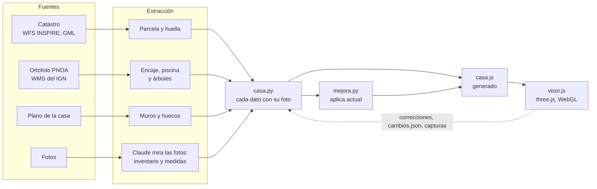

| Paso | Cómo se hace |
|---|---|
| **Coordenadas** | Dos marcos: el **mundo** (metros, x al este, z al sur, origen en el centro de la casa) y el **plano** (u, v alineados con los muros). Un giro y un desplazamiento pasan de uno a otro. |
| **Parcela** | Los servicios públicos del Catastro (OVC y WFS INSPIRE) dan con la referencia catastral la superficie, las construcciones, la ubicación y los polígonos de la parcela y del edificio en UTM. |
| **Ortofoto** | El PNOA del IGN por WMS, en la misma proyección: a 10 cm por píxel, pasar de píxel a metro es una regla de tres. Es la referencia de lo que está a ras de suelo. |
| **Muros** | Del plano con NumPy y Pillow, sin redes neuronales: los muros son los píxeles oscuros; sumados por columnas y filas, cada pico es un muro con su grosor, y cada corte, un hueco. |
| **Encaje** | Se prueban giros y desplazamientos del contorno del plano sobre los bordes de la ortofoto; gana el que más gradiente suma. La piscina sale de un análisis de componentes principales de los píxeles de agua. |
| **Fotos** | Sin fotogrametría: Claude ve cada foto y la mide como un aparejador, con objetos de tamaño conocido, el horizonte, triangulando entre dos fotos y anclando a las paredes del plano. El sol de la fecha y la hora del EXIF orienta cada foto. |
| **Texturas** | Recortes de las fotos sin la luz (se dividen por una versión muy desenfocada de sí mismos) y sin junta (mezclados con una copia desplazada media baldosa). Las de la demo son generadas. |
| **Generador** | `casa.py` es casi todo datos, con la foto de la que sale cada uno. Las correcciones van en capas encima de lo extraído. `mejora.py` es una función de la casa actual: lo que se corrige en la casa le llega solo. |
| **Visor** | three.js r128 y nada más: muros extruidos con sus huecos, tres tipos de cubierta, unos 140 tipos de mueble hechos con cajas, cilindros y esferas, árboles con `InstancedMesh`, el sol calculado con fórmulas astronómicas y el paseo con rayos en vez de un motor de física. |
| **Bucle** | Vite recarga el navegador al regenerar `casa.js`. Claude saca capturas con Chrome headless (`?vista=salon&limpio`) y las mira antes de dar algo por hecho. Cada ronda de correcciones es un commit. |

El detalle de cada paso, con los diagramas, está a continuación.

### Un sistema de coordenadas común

Cada fuente habla en su propio sistema: el Catastro y la ortofoto dan coordenadas UTM en metros, el
plano da píxeles y las fotos no dan coordenadas. Lo primero es fijar dos marcos y una fórmula para pasar
de uno a otro.

- **El mundo (x, z).** Metros, con x hacia el este y z hacia el sur (así lo quiere three.js, que usa y para
  la altura). El origen es el centro de la huella del edificio. Pasar de UTM es restar ese punto:
  x = E − E₀ y z = −(N − N₀).
- **El plano (u, v).** Metros, alineados con los muros: u hacia la derecha del plano y v hacia abajo. Casi
  todo lo de la casa (muros, muebles, puertas) se escribe aquí, porque es donde las medidas son rectas y
  fáciles de pensar.

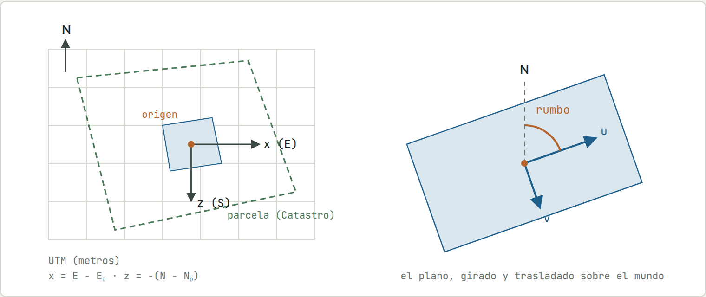

La casa tiene un rumbo (hacia dónde apunta el eje u del plano). Una sola función lleva cualquier punto del
plano al mundo, y otra hace lo contrario:

```python
# del marco del plano al mundo (G = 90° − rumbo)
def mundo(u, v):
    return (OX + u * cos(G) + v * sin(G),
            OZ - u * sin(G) + v * cos(G))
```

### La parcela, desde el Catastro

La Sede Electrónica del Catastro tiene servicios web públicos y sin registro. Con la referencia catastral
se hacen tres consultas; si solo tienes la ubicación, el mismo servicio devuelve la referencia a partir de
las coordenadas.

| Consulta | Servicio | Qué devuelve |
|---|---|---|
| Datos de la finca | OVC, `Consulta_DNPRC` | Superficie, uso, subparcelas de cultivo y construcciones (vivienda, porche, piscina…) con sus m². |
| Dónde está | OVC, `Consulta_CPMRC` | Latitud y longitud del centro. El visor las usa para calcular el sol. |
| Linderos y huella | WFS INSPIRE | El polígono de la parcela y el del edificio en GML, con coordenadas UTM. |

El GML es XML: una lista de pares este-norte. Se leen, se pasan al marco del mundo y quedan en el generador
como la parcela y la huella. La cartografía catastral tiene la precisión de su escala de captura, así que
**las fotos mandan**: si un lindero está unos metros más fuera de lo que dice el Catastro (y se ve en varias
fotos), se corrige con un desplazamiento a lo largo de su normal, dejando el dato original intacto al lado.

### La ortofoto

El Plan Nacional de Ortofotografía Aérea (PNOA) del IGN sirve fotos aéreas corregidas de perspectiva: cada
píxel está en su sitio del mapa, como si se mirase desde infinitamente alto. Se piden por WMS con una
petición `GetMap` en el mismo sistema que el Catastro, y así el paso de píxel a metro es una regla de tres:

```text
BBOX = 110 m × 155 m  →  WIDTH × HEIGHT = 1100 × 1550 px  →  10 cm por píxel
E = E_min + col × 0,1        N = N_max − fila × 0,1   # misma proyección
```

La ortofoto es la referencia de lo que está a ras de suelo: dónde cae la casa, la piscina, los caminos y
las copas de los árboles. Las alturas no salen de aquí, salen de las fotos.

### Del plano a los muros

Un script convierte la imagen del plano en geometría con NumPy y Pillow, sin redes neuronales. Lo único que
necesita saber es la escala, que sale de una medida conocida (milímetros por píxel). Después, cuatro pasos:

1. **Máscara de muros.** Los muros son los píxeles más oscuros del plano. Una máscara binaria los separa del
   resto (textos, cotas, muebles dibujados).
2. **Proyecciones.** Se suman los píxeles de muro de cada columna y de cada fila. Un muro vertical es una
   columna con muchos; donde la suma supera un umbral hay una banda, y cada banda es un muro con su grosor.
3. **Tramos y huecos.** Dentro de cada banda, los tramos continuos son muros y los cortes de 0,5 a 8 m son
   huecos. Si a un lado del hueco hay interior y al otro exterior, es una puerta o ventana de fachada; si no,
   un paso interior.
4. **Ventana o puerta.** Una ventana se dibuja con líneas finas dentro del grosor del muro; una puerta, con
   el arco de apertura hacia dentro. Se mira qué fracción de píxeles grises hay en cada zona.

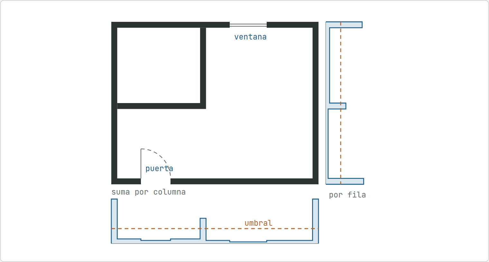

**Por qué funciona.** Un muro recto concentra muchos píxeles oscuros en pocas columnas (o filas). Las sumas
dibujan picos justo donde están los muros; por encima del umbral, cada pico es un muro con su grosor. La cota
o el texto que queda al lado de un muro ensancha el pico, y por eso se recorta cada banda a su núcleo.

El contorno exterior se saca rellenando desde el borde de la imagen: lo que no se alcanza sin cruzar muro es
la casa. El resultado, en metros y en el marco del plano, va a un JSON. Luego las fotos corrigen lo que el
plano tenga mal (una puerta que era ventana, una ventana desplazada). Esas correcciones van aparte, en
listas como `CORRIGE_MUROS` o `MUEVE_HUECOS`, y el extractor no se vuelve a tocar.

### Encajar la casa en el terreno

El plano no sabe dónde está el norte. Para colocar la casa en el mundo hacen falta tres números: un giro y un
desplazamiento en este y sur. Se buscan en la ortofoto, que sí está en su sitio.

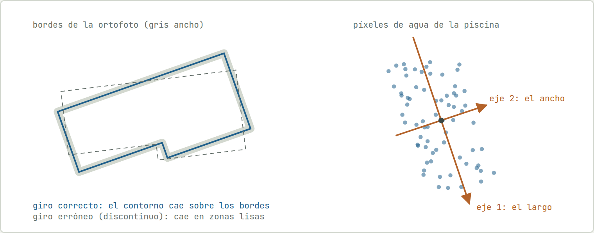

- **La casa.** Un tejado o una fachada se ve en la ortofoto como un cambio brusco de color, es decir, un
  gradiente alto. Se prueban giros y desplazamientos del contorno del plano y se suma el gradiente de la
  ortofoto por debajo de él; gana el que más suma.
- **La piscina.** Se toman los píxeles de color agua y se hace un análisis de componentes principales: la
  media es el centro, el vector propio mayor es el eje largo y la dispersión a lo largo de cada eje da el
  largo y el ancho.
- **Los árboles.** Las copas se ven como manchas oscuras y verdosas. Se marcan las zonas con densidad de
  vegetación, cada mancha da un centro y un radio, y se revisan sobre una imagen de control con todos los
  círculos pintados encima. La especie (pino, olivo, encina, ciprés…) sale de las fotos, y los árboles que la
  ortofoto no separa bien se mueven a mano en el visor. Cada uno lleva un ID fijo (`A-145`).

### De las fotos a los objetos

Aquí está la parte que más cuesta imaginar. **No hay fotogrametría**: nada reconstruye una nube de puntos ni
calcula la pose de la cámara. Claude es un modelo multimodal que ve cada foto y la mide como lo haría un
aparejador con la foto en la mano. Junta lo que sabe de óptica con objetos de tamaño conocido y con las
paredes que ya vienen del plano, y escribe el resultado como un número en el generador, con la foto de la
que sale.

#### 1 · El inventario: dónde se hizo cada foto

Antes de medir nada, se hace una tabla con cada foto: desde dónde, hacia dónde y qué se ve. Los datos del
móvil no bastan: el GPS se queda fijo en unos pocos puntos y la brújula se desvía decenas de grados. La
orientación buena la da el sol.

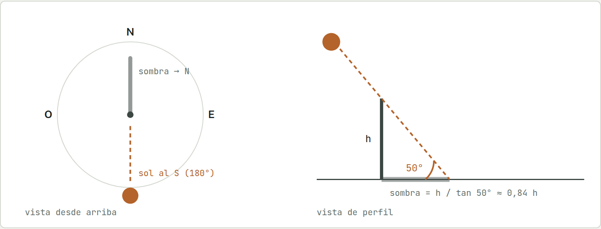

**El sol como brújula.** Con la fecha y hora de la foto (van en el EXIF) y la latitud se calcula dónde estaba
el sol. En el ejemplo, al sur y a 50° de altura: las sombras de la foto apuntan entonces al norte. Si en una
foto las sombras vienen hacia la cámara, se está mirando al sur; si van hacia la derecha, al oeste. La
longitud de la sombra (aquí, 0,84 veces la altura del objeto) sirve además para estimar alturas de postes,
muros o árboles.

#### 2 · Tamaño aparente y distancia

Una cámara de móvil se comporta como una cámara estenopeica: la luz pasa por un punto y forma la imagen
detrás. De ahí sale la regla más útil de todas: un objeto de altura H a una distancia d ocupa un ángulo θ, y
cuanto más lejos, más pequeño.

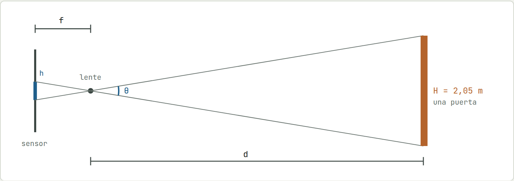

**Triángulos semejantes:** h / f = H / d. Si la foto trae el campo de visión (se deduce del EXIF o del modelo
de móvil), cada píxel es un ángulo, y un objeto de tamaño conocido da la distancia.

```text
d = H / (2 · tan(θ / 2))
# una puerta de 2,05 m que ocupa 20° de la foto está a  2,05 / (2 · tan 10°) = 5,8 m
```

Las referencias de tamaño conocido son las que hay en cualquier casa: puertas (unos 2 m), encimeras (90 cm),
mesas (75 cm), baldosas, estanterías de módulos estándar, enchufes, una silla… También las propias paredes,
cuyo largo ya viene del plano. Con una referencia en la misma foto no hace falta ni el campo de visión: basta
la proporción. «La tele mide un 70 % del ancho del mueble de 1,60 m» da una tele de 1,1 m.

#### 3 · El suelo y el horizonte

La segunda regla fija la distancia de cualquier cosa apoyada en el suelo. El móvil se sostiene a una altura
casi constante, unos 1,5 m. La línea del horizonte de la foto está a la altura de la cámara; cuanto más
abajo de ella aparece el pie de un objeto, más cerca está.

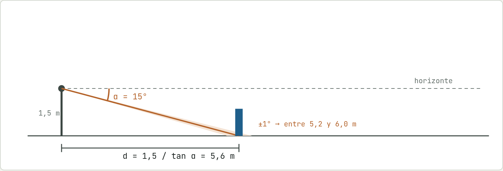

**Por qué lo cercano sale mejor que lo lejano.** La distancia depende de la tangente del ángulo bajo el
horizonte, y esa tangente se aplana cuando el ángulo es pequeño. El mismo grado de error pesa muy distinto
según lo lejos que esté la cosa:

| Ángulo bajo el horizonte | Distancia | Con ±1° de error |
|---|---|---|
| 30° | 2,6 m | 2,5 a 2,7 m |
| 15° | 5,6 m | 5,2 a 6,0 m |
| 5° | 17,1 m | 14,3 a 21,5 m |

Por eso, dentro de casa (todo está a menos de 6 m) las fotos bastan para colocar muebles, y fuera las
posiciones de lo lejano se toman de la ortofoto. De las fotos solo salen su forma, su altura y su material.

#### 4 · Dos fotos y las paredes del plano

Una sola foto da una dirección bastante fiable (qué hay a la izquierda o a la derecha de qué) y una distancia
menos fiable. Dos fotos del mismo objeto desde sitios distintos dan dos direcciones, y el objeto está donde se
cruzan. Además, la habitación ya existe: sus paredes vienen del plano. Casi todo mueble está pegado a una
pared o alineado con algo, así que la medida se ancla a ella: «contra la pared norte, centrado bajo la ventana».

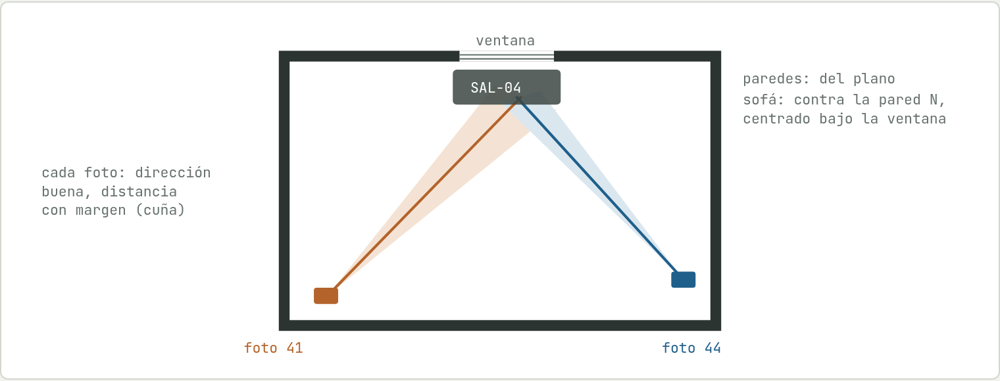

**Triangular y anclar.** Cada foto deja el objeto dentro de una cuña: dirección precisa, distancia
aproximada. Dos cuñas se cruzan en una zona pequeña, y la pared del plano termina de fijarlo.

#### 5 · Lo que queda escrito

El resultado de todo lo anterior es una línea de datos. La posición va en el marco del plano, en metros; el
tamaño, en medidas de catálogo o proporciones; y al lado, las fotos de las que sale:

```python
# el despacho
dict(id='DES-01', tipo='mesa',     uv=[2.19, 7.30], giro=90, largo=3.60, fondo=0.75, foto='2, 4, 5'),
dict(id='DES-08', tipo='kallax',   uv=[4.66, 7.72], giro=-90, cols=4, filas=4, foto='3, 4'),
dict(id='DES-10', tipo='radiador', uv=[3.10, 5.29], giro=0, foto='4, 5'),
```

**Precisión real:** de 10 a 30 cm dentro de casa y bastante más en lo lejano. Lo que cierra el error no es
más cálculo: lo cierran tus correcciones («`SAL-07` medio metro al norte») y el modo «Mover objetos», con el
que se arrastra el mueble a su sitio y el visor guarda la posición exacta. El tipo de mueble también es
aproximado: un sofá es un conjunto de cajas con sus medidas, no un modelo 3D.

### Texturas sacadas de las fotos

La piedra de las fachadas, la grava, el césped o el marès son recortes de las propias fotos. Un recorte tal
cual no sirve como textura por dos motivos: tiene la luz de ese momento (un lado más claro que otro) y, al
repetirlo, se ven las juntas. Se arreglan las dos cosas con NumPy:

- **Quitar la luz.** La iluminación cambia despacio a lo largo de la foto y la textura cambia deprisa. Se
  desenfoca el recorte con un filtro gaussiano muy ancho (eso deja solo la luz) y se divide el original por
  él. Queda la textura con una luz uniforme.
- **Quitar la junta.** Se mezcla la imagen con una copia de sí misma desplazada media baldosa. En el centro
  manda la original; en los bordes, la copia, que ahí es continua. El peso sigue una curva sin², que suma 1
  con su complementaria.

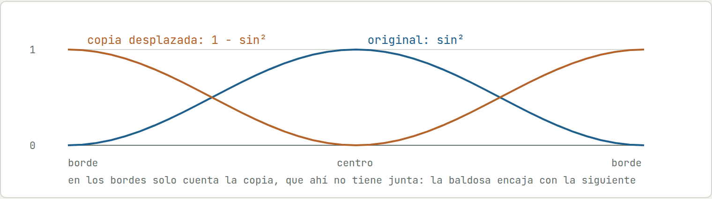

Las texturas de la casa de ejemplo no salen de fotos: las genera [`demo/herramientas/texturas.py`](demo/herramientas/texturas.py)
con ruido y celdas de Voronoi, y se repiten sin costuras de la misma forma.

### El generador: un fichero de datos

El generador ([`demo/herramientas/casa.py`](demo/herramientas/casa.py) en la demo) es casi todo datos: listas
de diccionarios con cubiertas, estancias, huecos, muebles, caminos y lindes. Lee lo extraído, aplica encima
las correcciones sacadas de las fotos, calcula lo que se puede deducir y escribe `casa.js`, que nunca se toca
a mano.

Algo de lógica sí hay. La altura de cada muro sale de la cubierta que tiene encima: en una cubierta a un agua
se interpola entre el lado alto y el bajo. Y cada puerta dice hasta dónde se abre: a 180° se pliega contra la
pared si la que sigue a la bisagra está libre en todo el ancho de la hoja (sin tabiques ni muebles pegados);
si no, se queda a 90°.

[`mejora.py`](demo/herramientas/mejora.py) no copia la casa. Es una función, `aplica(actual)`, que recibe la
casa actual y devuelve la reformada: qué muebles se quedan en cada estancia, suelos y pinturas nuevos, muros
que se abren y lo nuevo del jardín. Si se corrige la casa actual, la mejorada lo hereda sin hacer nada.

```python
# el final del generador
import mejora
(DEMO / 'casa.js').write_text('window.CASA = ' + j(casa) + ';\n'
                              'window.CASA_MEJORA = ' + j(mejora.aplica(casa)) + ';\n')
```

### El visor 3D

[`visor.js`](visor.js) (unas 4.900 líneas de JavaScript sin compilar) usa three.js r128, una librería sobre
WebGL. Lee `window.CASA` y construye la escena. Nada viene de un programa de modelado: cada pieza se levanta
con código.

| Qué | Cómo se hace |
|---|---|
| **Muros** | Cada tramo es un polígono en planta extruido hasta su altura (`ExtrudeGeometry`). Puertas y ventanas son agujeros en la forma (`Shape` con `holes`) de la cara del muro. |
| **Cubiertas** | Tres tipos: a dos aguas (con hastial o faldón), a un agua y plana con peto. Tejas, canecillos y vigas se reparten a lo largo. |
| **Muebles** | Unos 140 tipos (mesa, sofá, kallax, radiador, coche…), cada uno una función que junta cajas, cilindros y esferas con sus medidas. |
| **Árboles y piedras** | `InstancedMesh`: una sola geometría dibujada cientos de veces con matrices distintas. Así cientos de árboles y miles de piedras cuestan unas pocas llamadas a la GPU. |
| **Luz y sombras** | Una luz direccional (el sol) con mapa de sombras de 4096 px y filtrado PCF suave, más luz de cielo. Por la noche, las luces de cada estancia. |
| **Puertas** | Cada hoja cuelga de un pivote en la bisagra; abrir es animar el giro del pivote hasta el ángulo de sus datos. |
| **Dos versiones** | Muros, huecos e interior se construyen una vez por versión, en grupos separados. Cambiar con la V solo cambia qué grupos son visibles: por eso no se mueve la cámara. |
| **Fichas e IDs** | Cada malla guarda su ficha en `userData`. Un clic lanza un rayo (`Raycaster`) desde la cámara y la primera malla que toca abre su ficha. |

**El sol, calculado.** No se coloca a ojo: el visor lo calcula para la fecha, la hora y la latitud y longitud
de la casa con las fórmulas astronómicas de baja precisión (menos de un minuto de arco de error, más que
suficiente para sombras):

```text
n   = días desde el 1-1-2000 a las 12:00 UT
L   = 280,460° + 0,9856474° · n              # longitud media del sol
g   = 357,528° + 0,9856003° · n              # anomalía media
λ   = L + 1,915° · sin g + 0,020° · sin 2g   # longitud eclíptica
δ   = asin(sin ε · sin λ),  ε = 23,439°      # declinación
H   = hora sidérea local − ascensión recta   # ángulo horario
alt = asin(sin φ sin δ + cos φ cos δ cos H)
sol = 250 m · (cos alt · sin az,  sin alt,  −cos alt · cos az)
```

La hora se pasa de la de Madrid a UT con el cambio de horario (último domingo de marzo y de octubre). El mismo
cálculo es el que sirve para orientar las fotos por sus sombras.

**El paseo: rayos en vez de un motor de física.** Andar es lanzar unos pocos rayos en cada fotograma contra
las mallas visibles.

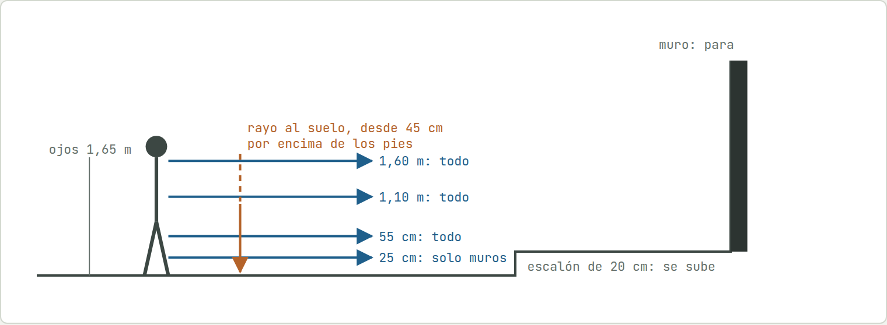

Si alguno de los cuatro rayos de delante toca algo más cerca que el paso más 30 cm de radio, no se avanza;
entonces se prueba solo el componente este-oeste o solo el norte-sur, y así se resbala a lo largo de la pared.
El de 25 cm solo mira muros, para que un peto bajo no se salte. El rayo hacia abajo encuentra el suelo: si
está como mucho 45 cm más alto, se sube (un escalón); si la cara que toca está inclinada más de 14°, es un
tejado y no se pisa; si es agua, no se entra.

### El bucle de trabajo

- **Recarga.** Vite sirve la carpeta y recarga el navegador en cuanto cambia un fichero. Claude ejecuta el
  generador, se regenera `casa.js` y el visor abierto se actualiza solo.
- **Capturas automáticas.** Claude abre el visor en Chrome sin ventana con una URL que fija la vista
  (`?vista=salon&limpio`), la versión (`&version=mejorada`), un objeto (`?id=H-12`) o un punto del paseo (`?pie=x,z,rumbo`), y
  mira la imagen antes de dar algo por hecho.
- **Mover objetos.** En el visor se arrastran y giran muebles o árboles. Un pequeño plugin de Vite
  ([`vite.config.js`](vite.config.js)) recibe cada cambio y lo escribe en `cambios.json`: ID, versión,
  posición de antes y de después y giro. Claude lo pasa a los datos y vacía el fichero.
- **IDs estables.** Cada objeto tiene un código que no se reutiliza. Un mensaje como «quita `A-087`» no
  depende de describir nada.
- **git.** Cada ronda de correcciones es un commit. Si algo empeora, se ve qué cambió.

### Métodos de programación

- **Una fuente de verdad y un fichero generado.** `casa.js` se reescribe entero cada vez; nadie lo edita.
  Generar es idempotente y tarda menos de un segundo.
- **Datos declarativos con procedencia.** La casa es una lista de datos, no código. Cada dato dice de qué foto
  sale, y así cualquier corrección se puede contrastar.
- **Correcciones en capas.** Lo extraído automáticamente no se retoca: las correcciones van en listas aparte
  que se aplican encima. Se puede volver a extraer sin perderlas.
- **Marcos de coordenadas explícitos.** Todo dato está en el marco del plano o en el del mundo, y una función
  pasa de uno a otro.
- **Derivar en vez de copiar.** La versión mejorada es una función de la actual.
- **Estado en la URL.** Vista, versión, hora, objeto o punto del paseo se fijan con parámetros; una captura se
  puede repetir exactamente.
- **Pocas dependencias.** Solo three.js en el navegador, sin compilar ni empaquetar. Python con dos librerías.
- **Verificación visual.** Cada cambio se comprueba mirando una captura, no solo ejecutando el código.

### Librerías y código propio

**Todo el modelado 3D es propio.** No hay modelos descargados, ni Blender, ni ficheros glTF u OBJ, ni un motor
de juego o de física. Cada muro, tejado, mueble, árbol o coche es una función que junta cajas, cilindros,
esferas y formas extruidas con sus medidas. three.js pone las piezas básicas y el dibujo en la tarjeta
gráfica; qué se construye con ellas y cómo se mueve uno por la casa está escrito para este proyecto.

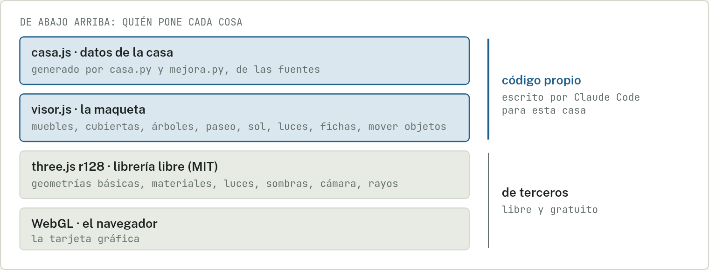

Con three.js se puede pedir «una caja de 2 × 0,9 × 0,6 m con este color»; que eso sea una encimera, dónde va y
a qué altura lo decide el código de arriba.

| Pieza de three.js | Para qué se usa aquí |
|---|---|
| Geometrías básicas | `BoxGeometry`, `CylinderGeometry`, `SphereGeometry`, `ConeGeometry`… Los ladrillos con los que se levanta todo. |
| Formas extruidas | `Shape` + `ExtrudeGeometry`: muros con sus huecos, perfiles de coches y tejados. |
| Materiales y texturas | Materiales Lambert y Phong. Las texturas son imágenes o se pintan en un canvas desde el código. |
| Luces y sombras | Luz direccional, de cielo y puntuales, con el mapa de sombras que trae three.js. |
| Instancias | `InstancedMesh` para dibujar cientos de árboles y piedras de una vez. |
| Rayos | `Raycaster`: la herramienta con la que se eligen objetos y se calculan las colisiones. |
| Render | `WebGLRenderer`, escena y cámara en perspectiva. |

No se usa nada de los extras de three.js (`examples/`): ni controles de órbita ni primera persona, ni cargadores
de modelos, ni posprocesado. Lo propio es todo lo demás: los objetos y las especies de árboles, los muros,
huecos y cubiertas, los controles (órbita, paseo con WASD o con los pulgares, colisiones, escalones, puertas),
el sol y el cielo (con un shader propio para el degradado), las dos versiones, las fichas, las capas, las luces
de noche, el modo «Mover objetos» y todo el Python.

| Qué | Dónde | Licencia |
|---|---|---|
| three.js r128 | En el navegador: la única librería del visor | MIT |
| Vite | Solo para trabajar en local (servidor y recarga); la página publicada no lo lleva | MIT |
| Node.js | Hace funcionar Vite | MIT |
| NumPy | Scripts de Python: matrices de píxeles | BSD |
| Pillow | Scripts de Python: abrir, recortar y guardar imágenes | MIT-CMU |
| Catastro e IGN | Datos públicos (parcela, huella, ortofoto), no código | Datos abiertos |

## Arrancar

```bash
npm install
npm run dev       # http://127.0.0.1:5173 — la casa de ejemplo, se recarga sola
npm run build     # dist/: la versión estática, la que se publica en GitHub Pages
npm run preview   # dist/ servida en http://127.0.0.1:5183
```

Otra casa: `CASA=casas/mi-casa npm run dev`. La carpeta lleva su `casa.js` (los datos que dibuja el
visor) y sus `texturas/`. La de ejemplo se genera con `python3 demo/herramientas/casa.py` y es el mejor
sitio para ver cómo se describe una casa; la referencia completa está en [`doc/datos.md`](doc/datos.md).

| Fichero | Qué es |
|---|---|
| `visor.js` | El motor: la escena three.js, los controles, el paseo a pie y el panel |
| `index.html` | Marcado y estilos del visor |
| `demo/` | La casa de ejemplo: sus datos (`casa.js`), cómo se generan y sus texturas |
| `CLAUDE.md` | Cómo trabaja Claude en este repo: montar una casa, cambiar el motor, publicar |
| `doc/datos.md` | Todo lo que entiende el visor en `casa.js` |
| `herramientas/build.mjs` | La versión estática en `dist/` |

---

Un proyecto de [Ars Magna](https://www.youtube.com/@arsmagna_lab), por Edu Herraiz.
Licencia [MIT](LICENSE).
